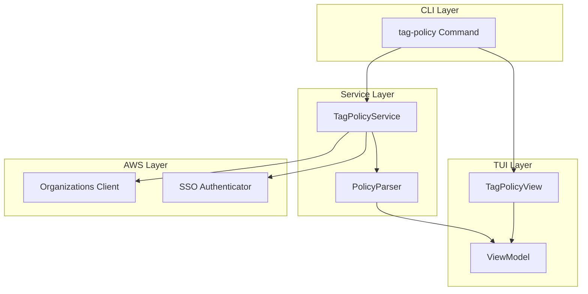
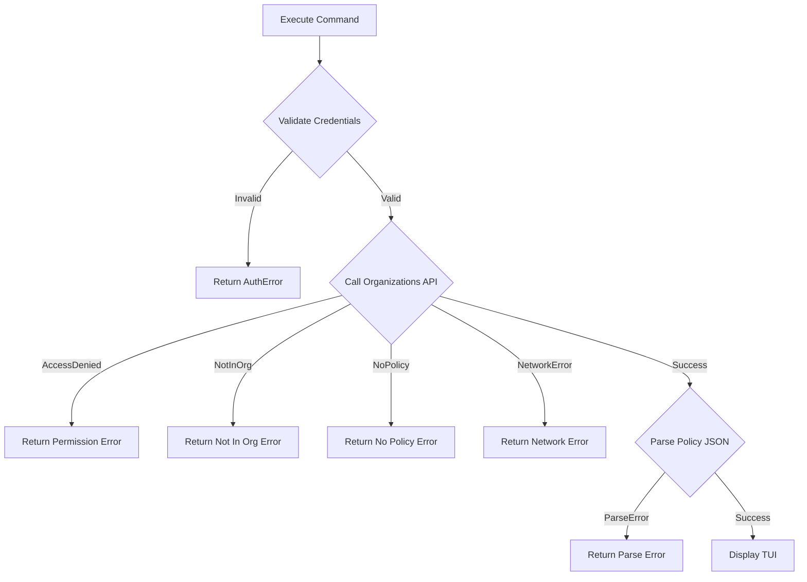

# Design Document: AWS Tag Policy Command

## Overview

This document describes the technical design for the `infra aws tag-policy` subcommand. The command retrieves effective tag policies from AWS Organizations and presents them through an interactive terminal user interface (TUI) that allows users to navigate tag keys and expand/collapse to view allowed values.

The implementation follows the existing patterns in the infra-cli project, using Cobra for command structure, AWS SDK for Go v2 for API interactions, and a lightweight TUI library for interactive display.

## Architecture



### Component Responsibilities

1. **CLI Layer**: Handles command registration, flag parsing, and orchestration
2. **Service Layer**: Manages AWS API calls and policy parsing logic
3. **TUI Layer**: Renders the interactive interface and handles keyboard input
4. **AWS Layer**: Provides authenticated access to AWS Organizations API

## Components and Interfaces

### 1. Tag Policy Command (`cmd/aws/tagpolicy.go`)

```go
// TagPolicyCmd represents the tag-policy subcommand
var TagPolicyCmd = &cobra.Command{
    Use:   "tag-policy",
    Short: "Display effective tag policy for the AWS account",
    Long:  `Retrieves and displays the effective tag policy from AWS Organizations.
    
Use arrow keys to navigate between tag keys, Enter/Space to expand/collapse,
and 'q' to quit.`,
    RunE: func(cmd *cobra.Command, args []string) error {
        return runTagPolicy()
    },
}
```

### 2. Tag Policy Service (`internal/aws/tagpolicy/service.go`)

```go
// TagPolicyService handles tag policy operations
type TagPolicyService struct {
    orgClient OrganizationsClient
    profile   string
    region    string
}

// OrganizationsClient interface for AWS Organizations operations
type OrganizationsClient interface {
    DescribeEffectivePolicy(ctx context.Context, params *organizations.DescribeEffectivePolicyInput, optFns ...func(*organizations.Options)) (*organizations.DescribeEffectivePolicyOutput, error)
}

// NewTagPolicyService creates a new tag policy service
func NewTagPolicyService(profile, region string) (*TagPolicyService, error)

// GetEffectiveTagPolicy retrieves the effective tag policy for the account
func (s *TagPolicyService) GetEffectiveTagPolicy(ctx context.Context) (*TagPolicy, error)
```

### 3. Policy Parser (`internal/aws/tagpolicy/parser.go`)

```go
// PolicyParser handles parsing of tag policy JSON
type PolicyParser struct{}

// Parse converts raw policy JSON into structured TagPolicy
func (p *PolicyParser) Parse(policyContent string) (*TagPolicy, error)

// ParseTagKey extracts tag key information from policy JSON node
func (p *PolicyParser) ParseTagKey(keyName string, keyData map[string]interface{}) (*TagKey, error)
```

### 4. TUI View (`internal/aws/tagpolicy/view.go`)

```go
// TagPolicyView handles the interactive TUI display
type TagPolicyView struct {
    model    *ViewModel
    selected int
    expanded map[int]bool
}

// ViewModel represents the view state
type ViewModel struct {
    TagKeys []TagKey
}

// NewTagPolicyView creates a new TUI view
func NewTagPolicyView(policy *TagPolicy) *TagPolicyView

// Run starts the interactive TUI loop
func (v *TagPolicyView) Run() error

// HandleKeyPress processes keyboard input
func (v *TagPolicyView) HandleKeyPress(key rune) (quit bool)

// Render draws the current view state to the terminal
func (v *TagPolicyView) Render() string
```

## Data Models

### TagPolicy

```go
// TagPolicy represents the complete effective tag policy
type TagPolicy struct {
    Tags []TagKey `json:"tags"`
}
```

### TagKey

```go
// TagKey represents a single tag key with its configuration
type TagKey struct {
    Name        string      `json:"tag_key"`
    Values      []string    `json:"tag_value,omitempty"`
    EnforcedFor []string    `json:"enforced_for,omitempty"`
}
```

### AWS Tag Policy JSON Structure

The AWS tag policy JSON follows this structure:

```json
{
    "tags": {
        "Environment": {
            "tag_key": {
                "@@assign": "Environment"
            },
            "tag_value": {
                "@@assign": ["Production", "Development", "Staging", "Test"]
            },
            "enforced_for": {
                "@@assign": ["ec2:instance", "s3:bucket"]
            }
        },
        "CostCenter": {
            "tag_key": {
                "@@assign": "CostCenter"
            },
            "tag_value": {
                "@@assign": ["Engineering", "Marketing", "Operations"]
            }
        }
    }
}
```

### View State

```go
// ViewState tracks the current TUI state
type ViewState struct {
    SelectedIndex int
    ExpandedKeys  map[int]bool
    TagKeys       []TagKey
}
```

### Error Types

The command uses existing error types from `internal/errors`:

- `AuthError`: For authentication failures
- `AWSAPIError`: For AWS Organizations API errors
- `ConfigError`: For configuration issues

New error scenarios specific to tag policies:

```go
// NewNoTagPolicyError creates an error when no tag policy exists
func NewNoTagPolicyError() *AWSAPIError {
    return &AWSAPIError{
        InfraError: InfraError{
            Category:   CategoryAWSAPI,
            Code:       "NO_TAG_POLICY",
            Message:    "No tag policy in effect",
            Details:    "The account does not have an effective tag policy.",
            Suggestion: "Tag policies are managed through AWS Organizations. Contact your organization administrator.",
        },
        Service:   "organizations",
        Operation: "DescribeEffectivePolicy",
    }
}

// NewNotInOrganizationError creates an error when account is not in an org
func NewNotInOrganizationError(cause error) *AWSAPIError {
    return &AWSAPIError{
        InfraError: InfraError{
            Category:   CategoryAWSAPI,
            Code:       "NOT_IN_ORGANIZATION",
            Message:    "Account is not part of an AWS Organization",
            Details:    "Tag policies require the account to be a member of an AWS Organization.",
            Suggestion: "Join an AWS Organization or create one to use tag policies.",
            Cause:      cause,
        },
        Service:   "organizations",
        Operation: "DescribeEffectivePolicy",
    }
}
```


## Correctness Properties

*A property is a characteristic or behavior that should hold true across all valid executions of a system—essentially, a formal statement about what the system should do. Properties serve as the bridge between human-readable specifications and machine-verifiable correctness guarantees.*

### Property 1: Policy Parsing Round-Trip

*For any* valid TagPolicy structure, serializing it to the AWS tag policy JSON format and then parsing it back SHALL produce an equivalent TagPolicy with the same tag keys, values, and enforced_for constraints.

**Validates: Requirements 2.1, 2.2, 2.3, 2.5**

### Property 2: Malformed JSON Produces Errors

*For any* string that is not valid JSON or does not conform to the AWS tag policy schema, the parser SHALL return an error rather than a partial or incorrect TagPolicy.

**Validates: Requirements 2.4**

### Property 3: Configuration Flags Passed Through

*For any* profile name and region value provided via flags, the TagPolicyService SHALL be initialized with those exact values for AWS API calls.

**Validates: Requirements 1.2, 1.3**

### Property 4: Render Output Contains All Tag Keys

*For any* TagPolicy with N tag keys, the rendered TUI output SHALL contain all N tag key names.

**Validates: Requirements 3.1**

### Property 5: Navigation State Changes Correctly

*For any* view state with selected index I and N total tag keys:
- Pressing Down SHALL result in index min(I+1, N-1)
- Pressing Up SHALL result in index max(I-1, 0)

**Validates: Requirements 3.2**

### Property 6: Toggle Expand/Collapse is Reversible

*For any* view state and selected tag key, pressing Enter (or Space) twice SHALL return the expanded/collapsed state to its original value.

**Validates: Requirements 3.3**

### Property 7: Expanded Keys Show All Values

*For any* expanded tag key with M allowed values, the rendered output SHALL contain all M values.

**Validates: Requirements 3.4**

### Property 8: Render Reflects View State

*For any* view state:
- The rendered output SHALL contain a selection indicator at the currently selected index
- Each tag key SHALL display an expansion indicator matching its expanded/collapsed state

**Validates: Requirements 3.6, 3.7**

## Error Handling

### AWS API Errors

| Error Condition | AWS Error Code | User Message | Suggestion |
|----------------|----------------|--------------|------------|
| No tag policy exists | EffectivePolicyNotFoundException | "No tag policy in effect" | "Tag policies are managed through AWS Organizations." |
| Not in organization | AWSOrganizationsNotInUseException | "Account is not part of an AWS Organization" | "Join an AWS Organization to use tag policies." |
| Access denied | AccessDeniedException | "Insufficient permissions" | "Ensure you have organizations:DescribeEffectivePolicy permission." |
| Network error | Various | "Failed to connect to AWS" | "Check your network connection and try again." |

### Error Flow



### Error Type Mapping

```go
func mapAWSError(err error) error {
    var apiErr smithy.APIError
    if errors.As(err, &apiErr) {
        switch apiErr.ErrorCode() {
        case "EffectivePolicyNotFoundException":
            return NewNoTagPolicyError()
        case "AWSOrganizationsNotInUseException":
            return NewNotInOrganizationError(err)
        case "AccessDeniedException":
            return NewAWSAPIError("AccessDenied", "Insufficient permissions to describe tag policy", "organizations", "DescribeEffectivePolicy", err)
        default:
            return NewAWSAPIError(apiErr.ErrorCode(), apiErr.ErrorMessage(), "organizations", "DescribeEffectivePolicy", err)
        }
    }
    return NewInternalError("unexpected error from AWS Organizations", err)
}
```

## Testing Strategy

### Dual Testing Approach

This feature uses both unit tests and property-based tests for comprehensive coverage:

- **Unit tests**: Verify specific examples, edge cases, and error conditions
- **Property tests**: Verify universal properties across randomly generated inputs

### Property-Based Testing Configuration

- **Library**: github.com/leanovate/gopter (already in project dependencies)
- **Minimum iterations**: 100 per property test
- **Tag format**: `Feature: aws-tag-policy, Property N: <property_text>`

### Test Structure

```
internal/aws/tagpolicy/
├── service_test.go      # Service layer tests
├── parser_test.go       # Parser property tests and unit tests
├── view_test.go         # TUI view property tests and unit tests
└── testdata/
    ├── valid_policy.json
    ├── empty_policy.json
    └── malformed_policy.json
```

### Property Test Implementation

Each correctness property maps to a single property-based test:

| Property | Test File | Test Function |
|----------|-----------|---------------|
| P1: Round-trip | parser_test.go | TestPolicyParsingRoundTrip |
| P2: Malformed errors | parser_test.go | TestMalformedJSONProducesErrors |
| P3: Config flags | service_test.go | TestConfigurationFlagsPassedThrough |
| P4: Render all keys | view_test.go | TestRenderContainsAllTagKeys |
| P5: Navigation | view_test.go | TestNavigationStateChanges |
| P6: Toggle reversible | view_test.go | TestToggleExpandCollapseReversible |
| P7: Expanded values | view_test.go | TestExpandedKeysShowAllValues |
| P8: Render state | view_test.go | TestRenderReflectsViewState |

### Unit Test Coverage

Unit tests focus on:
- Specific AWS error code handling
- Edge cases (empty policy, single tag key, no values)
- Command registration and flag inheritance
- TUI quit behavior ('q' key)

### Test Data Generators

```go
// Generate random TagPolicy for property tests
func genTagPolicy() gopter.Gen {
    return gen.SliceOf(genTagKey()).Map(func(keys []TagKey) *TagPolicy {
        return &TagPolicy{Tags: keys}
    })
}

// Generate random TagKey
func genTagKey() gopter.Gen {
    return gopter.CombineGens(
        gen.Identifier(),                    // Name
        gen.SliceOf(gen.Identifier()),       // Values
        gen.SliceOf(gen.Identifier()),       // EnforcedFor
    ).Map(func(vals []interface{}) TagKey {
        return TagKey{
            Name:        vals[0].(string),
            Values:      vals[1].([]string),
            EnforcedFor: vals[2].([]string),
        }
    })
}
```
