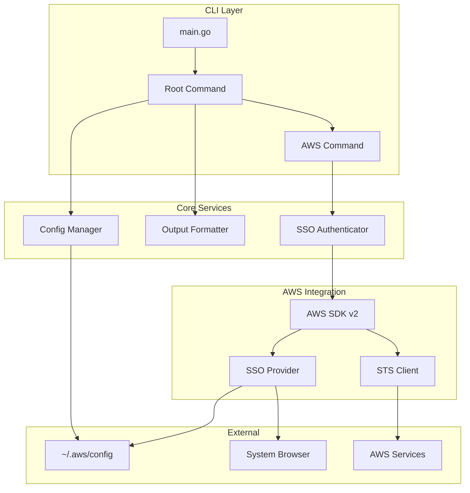
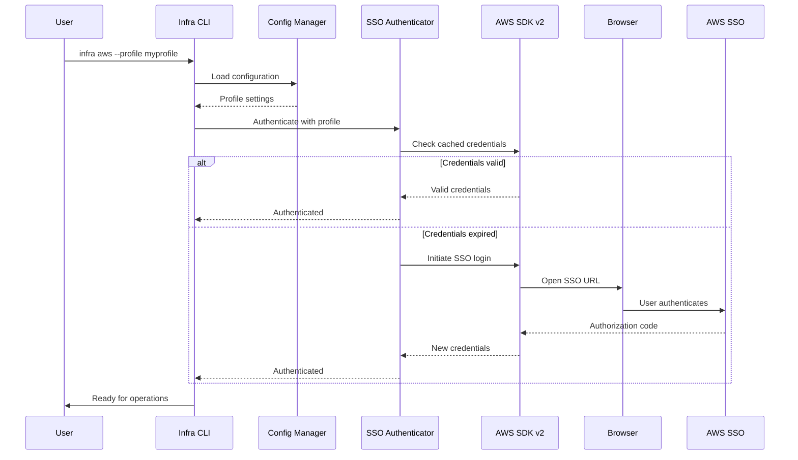

# Design Document: Infra CLI Tool

## Overview

The Infra CLI is a cross-platform command-line tool built with Go and the Cobra framework, designed to assist DevOps/CloudOps engineers with daily automation tasks. The initial focus is on AWS SSO authentication to establish proper credentials before expanding to other AWS operations.

The CLI follows a modular architecture where each major feature (aws, future: k8s, terraform, etc.) is implemented as a separate sub-command module. This design enables easy extension without modifying core functionality.

### Key Design Decisions

1. **Cobra Framework**: Chosen for its mature ecosystem, excellent documentation, and built-in support for nested commands, flags, and auto-generated help.

2. **AWS SDK v2**: Selected over v1 for improved performance, better error handling, and native SSO support.

3. **Output Formatter Pattern**: A unified output layer that supports JSON, YAML, and table formats, allowing consistent output handling across all commands.

4. **Configuration Precedence**: Flags > Environment Variables > Config File > Defaults, following the principle of least surprise.

## Architecture



### Component Interaction Flow



## Components and Interfaces

### 1. Root Command (`cmd/root.go`)

The entry point for the CLI that initializes global flags and configuration.

```go
// RootCmd represents the base command
type RootCmd struct {
    config  *Config
    output  OutputFormatter
    verbose bool
    quiet   bool
    format  string
}

// Global flags available to all commands
type GlobalFlags struct {
    Verbose bool   // --verbose, -v
    Quiet   bool   // --quiet, -q
    Output  string // --output, -o (json|yaml|table)
}
```

### 2. AWS Command (`cmd/aws/aws.go`)

Parent command for all AWS-related operations.

```go
// AWSCmd represents the aws sub-command
type AWSCmd struct {
    profile string
    region  string
    auth    *SSOAuthenticator
}

// AWS-specific flags
type AWSFlags struct {
    Profile string // --profile, -p
    Region  string // --region, -r
}
```

### 3. SSO Authenticator (`internal/aws/auth/sso.go`)

Handles AWS SSO authentication flow.

```go
// SSOAuthenticator manages AWS SSO authentication
type SSOAuthenticator interface {
    // Authenticate performs SSO authentication for the given profile
    Authenticate(ctx context.Context, profile string) (aws.Credentials, error)
    
    // IsAuthenticated checks if valid credentials exist
    IsAuthenticated(ctx context.Context, profile string) bool
    
    // GetCredentials returns cached credentials if valid
    GetCredentials(ctx context.Context, profile string) (aws.Credentials, error)
}

// SSOConfig holds SSO configuration from AWS config file
type SSOConfig struct {
    SSOStartURL   string
    SSORegion     string
    SSOAccountID  string
    SSORoleName   string
}
```

### 4. Config Manager (`internal/config/config.go`)

Manages application configuration from multiple sources.

```go
// ConfigManager handles configuration loading and merging
type ConfigManager interface {
    // Load reads configuration from all sources
    Load() (*Config, error)
    
    // Get returns a configuration value by key
    Get(key string) interface{}
    
    // GetString returns a string configuration value
    GetString(key string) string
}

// Config represents the application configuration
type Config struct {
    DefaultProfile string `yaml:"default_profile" env:"INFRA_DEFAULT_PROFILE"`
    DefaultRegion  string `yaml:"default_region" env:"INFRA_DEFAULT_REGION"`
    DefaultOutput  string `yaml:"default_output" env:"INFRA_DEFAULT_OUTPUT"`
    Verbose        bool   `yaml:"verbose" env:"INFRA_VERBOSE"`
}
```

### 5. Output Formatter (`internal/output/formatter.go`)

Handles output formatting in multiple formats.

```go
// OutputFormatter formats data for display
type OutputFormatter interface {
    // Format converts data to the specified format
    Format(data interface{}) (string, error)
    
    // SetFormat sets the output format (json, yaml, table)
    SetFormat(format string) error
}

// OutputFormat represents supported output formats
type OutputFormat string

const (
    FormatJSON  OutputFormat = "json"
    FormatYAML  OutputFormat = "yaml"
    FormatTable OutputFormat = "table"
)

// TableConfig configures table output
type TableConfig struct {
    Headers []string
    Columns []string
}
```

### 6. Profile Manager (`internal/aws/profile/manager.go`)

Manages AWS profile resolution and validation.

```go
// ProfileManager handles AWS profile operations
type ProfileManager interface {
    // ResolveProfile determines which profile to use
    ResolveProfile(flagProfile string) string
    
    // GetProfileConfig returns configuration for a profile
    GetProfileConfig(profile string) (*ProfileConfig, error)
    
    // ListProfiles returns all available profiles
    ListProfiles() ([]string, error)
}

// ProfileConfig holds AWS profile configuration
type ProfileConfig struct {
    Name        string
    Region      string
    SSOConfig   *SSOConfig
    RoleARN     string
    SourceProfile string
}
```

## Data Models

### Configuration File Structure

Location: `~/.config/infra/config.yaml` (Linux), `~/Library/Application Support/infra/config.yaml` (MacOS), `%APPDATA%\infra\config.yaml` (Windows)

```yaml
# Infra CLI Configuration
default_profile: "my-sso-profile"
default_region: "us-east-1"
default_output: "table"
verbose: false
```

### AWS Profile Configuration (read from ~/.aws/config)

```ini
[profile my-sso-profile]
sso_start_url = https://my-org.awsapps.com/start
sso_region = us-east-1
sso_account_id = 123456789012
sso_role_name = AdministratorAccess
region = us-west-2
output = json
```

### Internal Data Structures

```go
// Credentials represents AWS credentials
type Credentials struct {
    AccessKeyID     string
    SecretAccessKey string
    SessionToken    string
    Expiration      time.Time
    Source          string // "sso", "env", "profile", etc.
}

// AuthResult represents the result of authentication
type AuthResult struct {
    Success     bool
    Credentials *Credentials
    Profile     string
    Region      string
    Error       error
}

// CommandResult represents the result of a command execution
type CommandResult struct {
    Success bool
    Data    interface{}
    Error   error
}
```

### Error Types

```go
// AuthError represents authentication-related errors
type AuthError struct {
    Code    string
    Message string
    Profile string
    Cause   error
}

// ConfigError represents configuration-related errors
type ConfigError struct {
    Code    string
    Message string
    Source  string // "file", "env", "flag"
    Cause   error
}
```


## Correctness Properties

*A property is a characteristic or behavior that should hold true across all valid executions of a system—essentially, a formal statement about what the system should do. Properties serve as the bridge between human-readable specifications and machine-verifiable correctness guarantees.*

Based on the prework analysis, the following properties have been identified for property-based testing:

### Property 1: Profile Resolution Chain

*For any* combination of profile flag value, AWS_PROFILE environment variable, and default profile, the Profile_Manager SHALL resolve to the correct profile following the precedence: flag > environment variable > "default".

**Validates: Requirements 3.1, 3.2, 3.3**

### Property 2: Configuration Precedence

*For any* configuration key that can be set via flag, environment variable, and config file simultaneously, the resolved value SHALL equal the value from the highest priority source (flags > env vars > config file > defaults).

**Validates: Requirements 7.4**

### Property 3: JSON Output Round-Trip

*For any* valid data structure, formatting it as JSON and then parsing the JSON output SHALL produce a data structure equivalent to the original.

**Validates: Requirements 9.6**

### Property 4: YAML Output Round-Trip

*For any* valid data structure, formatting it as YAML and then parsing the YAML output SHALL produce a data structure equivalent to the original.

**Validates: Requirements 9.7**

### Property 5: Table Column Alignment

*For any* tabular data with multiple rows, all cells in the same column SHALL start at the same horizontal position in the formatted output.

**Validates: Requirements 9.8**

### Property 6: Error Exit Codes

*For any* operation that results in an error, the CLI SHALL exit with a non-zero exit code.

**Validates: Requirements 8.2**

### Property 7: Success Exit Codes

*For any* operation that completes successfully, the CLI SHALL exit with exit code 0.

**Validates: Requirements 8.5**

### Property 8: Help Flag Availability

*For any* command or sub-command in the CLI, invoking it with --help SHALL produce non-empty help text containing the command name.

**Validates: Requirements 5.4**

### Property 9: Credential Validation Before Operations

*For any* AWS operation command, the CLI SHALL validate credentials before attempting the operation, and SHALL fail with an appropriate error if credentials are invalid or missing.

**Validates: Requirements 6.5**

### Property 10: Output Verbosity Control

*For any* operation, when --verbose is set the output length SHALL be greater than or equal to the output without --verbose, and when --quiet is set the output length SHALL be less than or equal to the output without --quiet.

**Validates: Requirements 8.3, 8.4**

### Property 11: AWS Error Message Clarity

*For any* AWS API error, the formatted error message SHALL contain both the AWS error code and a human-readable description.

**Validates: Requirements 4.4, 8.1**

### Property 12: Region Flag Override

*For any* region value provided via --region flag, that region SHALL be used for AWS operations regardless of profile or environment configuration.

**Validates: Requirements 4.3, 6.4**

### Property 13: OS-Agnostic Path Handling

*For any* file path constructed by the CLI, the path SHALL use the correct path separator for the current operating system and SHALL not contain invalid path characters.

**Validates: Requirements 1.4**

## Error Handling

### Error Categories

| Category | Exit Code | Description |
|----------|-----------|-------------|
| Success | 0 | Operation completed successfully |
| Authentication Error | 1 | SSO login failed, credentials expired |
| Configuration Error | 2 | Invalid config file, missing required settings |
| AWS API Error | 3 | AWS service returned an error |
| Input Validation Error | 4 | Invalid flags, arguments, or input |
| Internal Error | 5 | Unexpected internal error |

### Error Message Format

```
Error: [Category] - [Brief Description]

Details: [Detailed explanation]

Suggestion: [How to fix the issue]

For more information, run with --verbose flag.
```

### Example Error Messages

**Authentication Error:**
```
Error: Authentication Failed - SSO session expired

Details: Your AWS SSO session for profile 'my-profile' has expired.

Suggestion: Run 'aws sso login --profile my-profile' to refresh your session,
or let infra handle it automatically by running your command again.
```

**Configuration Error:**
```
Error: Configuration Invalid - Profile not found

Details: The profile 'nonexistent-profile' was not found in ~/.aws/config.

Suggestion: Check your AWS configuration file or use --profile to specify
a valid profile. Run 'infra aws profiles' to list available profiles.
```

### Error Recovery Strategies

1. **SSO Token Expired**: Automatically initiate SSO login flow
2. **Profile Not Found**: List available profiles and suggest alternatives
3. **Region Invalid**: Show list of valid AWS regions
4. **Network Error**: Suggest checking connectivity, offer retry

## Testing Strategy

### Dual Testing Approach

This project uses both unit tests and property-based tests for comprehensive coverage:

- **Unit tests**: Verify specific examples, edge cases, and error conditions
- **Property tests**: Verify universal properties across randomly generated inputs

### Property-Based Testing Configuration

- **Library**: Use `github.com/leanovate/gopter` for Go property-based testing
- **Iterations**: Minimum 100 iterations per property test
- **Tagging**: Each test must reference its design property

**Tag Format**: `Feature: devops-cli-tool, Property {number}: {property_text}`

### Test Organization

```
tests/
├── unit/
│   ├── config_test.go       # Config loading unit tests
│   ├── output_test.go       # Output formatter unit tests
│   └── profile_test.go      # Profile resolution unit tests
├── property/
│   ├── config_prop_test.go  # Property 2: Configuration precedence
│   ├── output_prop_test.go  # Properties 3, 4, 5: Output formatting
│   ├── profile_prop_test.go # Property 1: Profile resolution
│   └── cli_prop_test.go     # Properties 6, 7, 8, 10: CLI behavior
└── integration/
    ├── aws_auth_test.go     # AWS SSO integration tests
    └── e2e_test.go          # End-to-end CLI tests
```

### Property Test Examples

**Property 1: Profile Resolution Chain**
```go
// Feature: devops-cli-tool, Property 1: Profile Resolution Chain
func TestProfileResolutionChain(t *testing.T) {
    properties := gopter.NewProperties(nil)
    
    properties.Property("profile flag takes precedence", prop.ForAll(
        func(flagProfile, envProfile string) bool {
            // Set up environment
            os.Setenv("AWS_PROFILE", envProfile)
            defer os.Unsetenv("AWS_PROFILE")
            
            resolved := ResolveProfile(flagProfile)
            return resolved == flagProfile
        },
        gen.AlphaString(),
        gen.AlphaString(),
    ))
    
    properties.TestingRun(t)
}
```

**Property 3: JSON Output Round-Trip**
```go
// Feature: devops-cli-tool, Property 3: JSON Output Round-Trip
func TestJSONRoundTrip(t *testing.T) {
    properties := gopter.NewProperties(nil)
    
    properties.Property("JSON format is reversible", prop.ForAll(
        func(data map[string]interface{}) bool {
            formatted, err := FormatJSON(data)
            if err != nil {
                return false
            }
            
            var parsed map[string]interface{}
            err = json.Unmarshal([]byte(formatted), &parsed)
            return err == nil && reflect.DeepEqual(data, parsed)
        },
        gen.MapOf(gen.AlphaString(), gen.AlphaString()),
    ))
    
    properties.TestingRun(t)
}
```

### Unit Test Focus Areas

- **Edge cases**: Empty profiles, missing config files, invalid regions
- **Error conditions**: Network failures, permission errors, malformed input
- **Integration points**: AWS SDK initialization, config file parsing
- **Specific examples**: Known profile configurations, expected output formats

### Test Coverage Goals

| Component | Unit Test Coverage | Property Test Coverage |
|-----------|-------------------|----------------------|
| Config Manager | 80% | Properties 2 |
| Output Formatter | 80% | Properties 3, 4, 5 |
| Profile Manager | 80% | Property 1 |
| SSO Authenticator | 70% | Property 9 |
| CLI Commands | 70% | Properties 6, 7, 8, 10 |
| AWS Integration | 60% | Properties 11, 12 |
